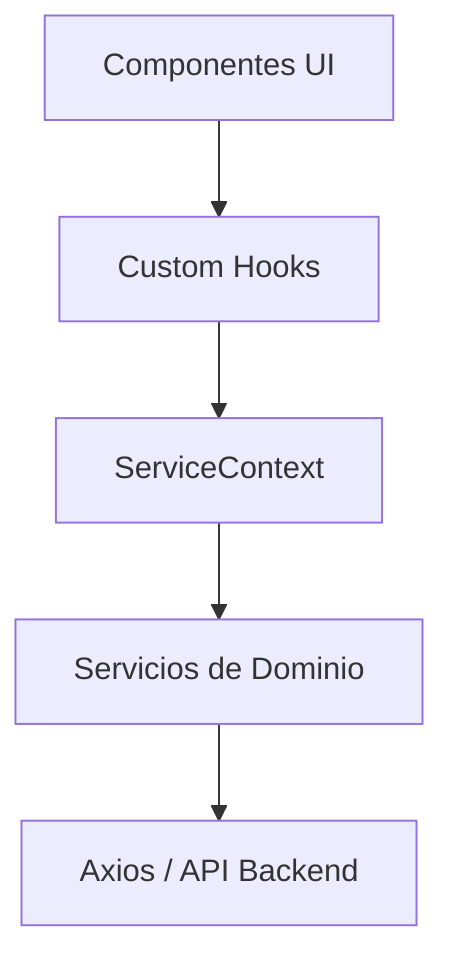

# Aurora | FrontEnd

## By: TatoNaranjo & Santorar


## Tabla de Contenidos :page_with_curl:

- [Nuestro Espacio de Trabajo](#nuestro-espacio-de-trabajo)
- [Qué es Aurora?](#qué-es-aurora)
- [Dependencias](#dependencias)
- [Pasos de Instalación](#pasos-de-instalación)
- [Notas Adicionales](#notas-adicionales)
- [Licencia](#licencia)
- [Contacto](#contacto)

## Nuestro Espacio de Trabajo


## Qué es Aurora?

Este sistema ha sido desarrollado como parte de un proyecto de investigación en la Universidad de Cundinamarca Extensión Facatativá, con el objetivo de proporcionar a los estudiantes practicantes del programa de Psicología una herramienta de apoyo para el diagnóstico de trastornos depresivos.
Utilizando técnicas avanzadas de Machine Learning, el sistema analiza datos clínicos para identificar patrones y factores de riesgo asociados a trastornos depresivos, proporcionando una herramienta complementaria al juicio clínico profesional.

Este repositorio fue creado en el mes de Diciembre del año 2024

## Arquitectura Frontend :building_construction:

El proyecto utiliza una arquitectura basada en servicios e inyección de dependencias para desacoplar la lógica de negocio de la interfaz de usuario.

### Estructura General



### Componentes Clave

1.  **Servicios (`src/services/`)**:
    - Clases que encapsulan la comunicación con el backend (Django Apps).
    - Ejemplos: `AuthService`, `DiagnosticosService`, `PacientesService`.
    - Siguen interfaces estrictas (`src/services/serviceInterfaces.ts`).

2.  **Contexto (`src/context/`)**:
    - `ServiceContext`: Contenedor de inyección de dependencias.
    - `ServiceProvider`: Proveedor que instancia los servicios y los hace disponibles para toda la app.

3.  **Hooks (`src/hooks/`)**:
    - `useServices()`: Hook de bajo nivel para acceder a los servicios.
    - **Hooks de Dominio**: `useAuth`, `useDiagnosticos`, `usePacientes`, `useUser`. Encapsulan estado (loading, error) y lógica de negocio.

### Manejo de Estado de Usuario

El estado del usuario (autenticación) se maneja a través de Redux (`userSlice`), pero se accede en los componentes mediante el hook `useUser` para evitar acoplamiento directo con el store.

```typescript
// Ejemplo de uso
import { useUser } from "@/hooks";

const MyComponent = () => {
  const { usuario, isAuthenticated } = useUser();
  // ...
};
```

## Dependencias :warning:

- 
- 
- 
- 
- 

## Pasos de Instalación :checkered_flag:

Sigue estos pasos para instalar y ejecutar el proyecto en tu máquina local.

1. Clona el repositorio:

```
git clone https://github.com/TatoNaranjo/Aurora-Front-End
cd Aurora-Front-End
```

2. Instala las dependencias:

```
npm install
```

3. Inicia el servidor de desarrollo:

```
npm run dev
```

Esto iniciará la aplicación en `http://localhost:5173` (o un puerto diferente si el `5173` ya está en uso).

## Notas adicionales :construction:

- Asegúrate de tener Node.js y npm instalados en tu sistema.

- Los scripts principales para el desarrollo son `npm run dev` para iniciar el servidor de desarrollo y `npm run build` para generar una versión de producción de la aplicación.

Si encuentras algún problema o tienes sugerencias, no dudes en abrir un issue en este repositorio. ¡Agradecemos tu colaboración!

## Licencia :door:

Este proyecto está licenciado bajo la [Licencia MIT](https://opensource.org/licenses/MIT).

## Contacto :computer:

Para preguntas o comentarios, puedes contactarme a través de mi [correo electrónico](mailto:aurora.soporte.udec@gmail.com).
